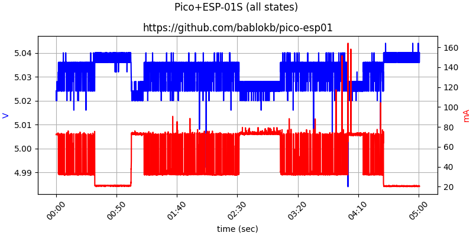

Raspberry Pi Pico and ESP-01S
=============================

In this project you will find a CircuitPython sample program which uses the
ESP-01S as a coprocessor to send data using UDP.

The main reason is to investigate the current consumption during the
various states (idle, connected, sending, sleep).

Hardware
--------

The setup uses a cheap ESP-01S breakout, connected with five jumpers
to the Pi Pico:

  - Vcc to 3V3
  - GND to GND
  - RX  to TX (GP0)
  - TX  to RX (GP1)
  - RST to GP2

In addition, there are two buttons connected to GP26 and GP27. These
buttons switch between states. See the program in `src/main.py` for
details.

Results
-------

The current was measured on the high-side and is the sum of the pico
and the ESP-01S.

Mapping of states to time-points:

  -  00:00 - 00:30  idle
  -  00:30 - 01:00  sleep
  -  01:00 - 01:30  idle
  -  01:30 - 02:00  connected to AP
  -  02:00 - 02:30  udp-socket open
  -  02:30 - 03:06  send
  -  03:06 - 03:30  udp-socket open
  -  03:30 - 04:00  connected to AP
  -  04:00 - 04:30  idle
  -  04:30 - 05:00  sleep

The states "idle" and "connected" consume about the same (with high variation),
whereas during data-transfer the (mean) current-draw is much higher.

Depending on the setup (additional peripherals) it might be better to provide
a dedicated 3V3 source for the ESP-01S.

Sleep mode reduces the current draw for the ESP-01S drastically. Passing
zero as argument to the `deep_sleep(ms)`-method will prevent wakeup
until the RST-pin kicks in, which is the normal setup when using
the ESP-01S as coprocessor.

When searching for "ESP-01S deep-sleep" you will find hardware-mods
recommending connecting pin 16 of the ESP8266 to the RST-pin. This
is not necessary in this setup.

Note that in a realistic application, the program would not only send the
ESP-01S to sleep, but also switch the pico to (deep-) sleep-mode.
